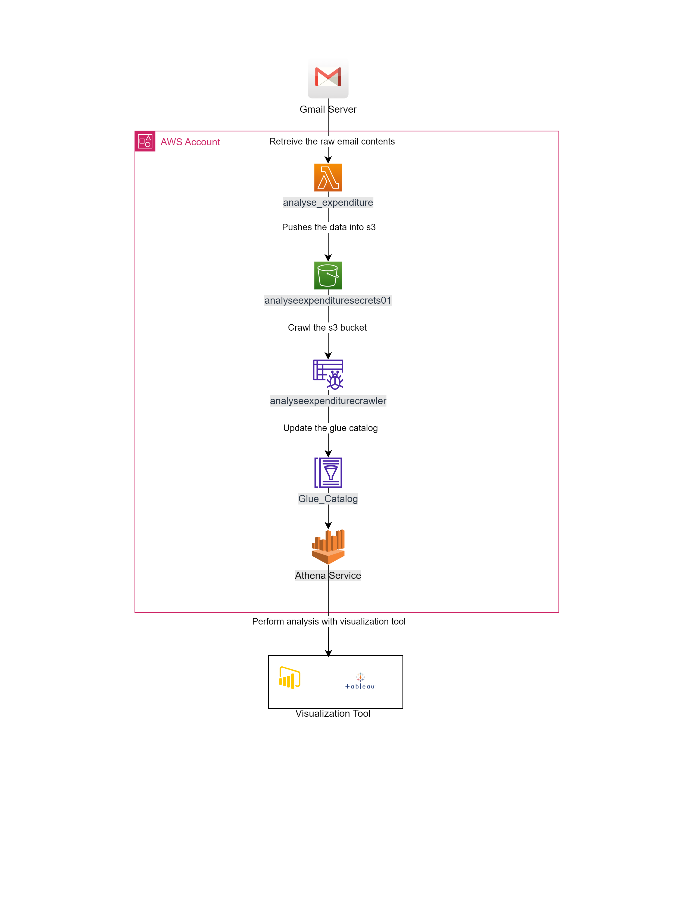

The goal of this project is to create a workflow to analyse my expense.

__<u>Project Overview</u>__

1. The lambda function scraps payment alert html data from the email, cleans it and uploads it into s3 bucket as a csv on daily basis.
2. The crawler updates the glue catalog on daily basis.
3. Analysis can be by connecting any visualization tool like Tableau, PowerBI with Athena 

Following events will generate an alert to my email:
- Cash is withdrawn from my account
- Payment made via UPI or Netbanking

__<u>Architecture Diagram</u>__

__<u>Alert Email Image</u>__

