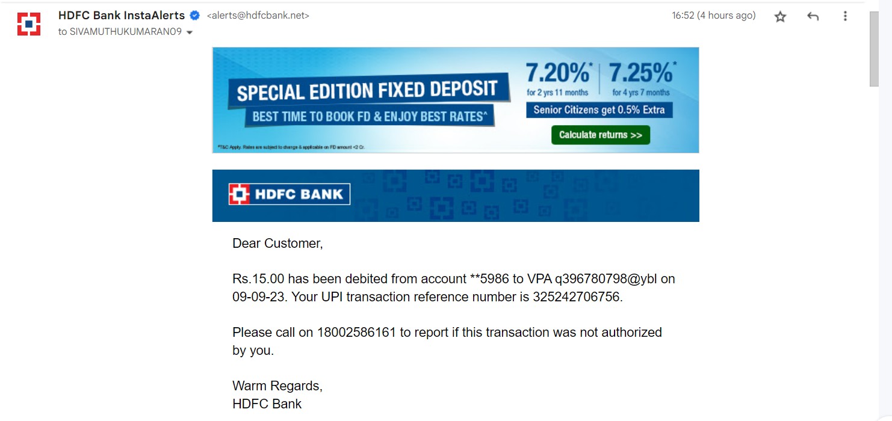

The goal of this project is to create a workflow to analyse my expenditure.
Resources are deployed as cloudformation stack.

__<u>Project Overview</u>__

1. The lambda function retreives Google API credentials and uses it to retreive the html email content from Gmail server via IMAP protocol
2. Lambda function cleans the html function and uploads it into s3 bucket as a csv on daily basis.
3. The crawler updates the glue catalog on daily basis.
4. Analysis can be by connecting any visualization tool like Tableau, PowerBI with Athena 

Following events will generate an alert to my email:
- Cash is withdrawn from my account
- Payment made via UPI or Netbanking

__<u>Architecture Diagram</u>__

__<u>Alert Email Image</u>__

